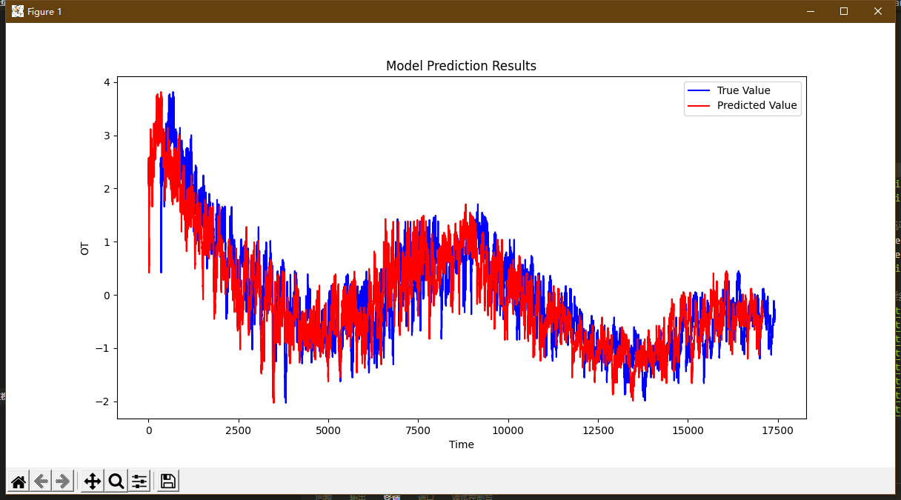

时间序列回归项目步骤：

### 数据处理
1. 读取并加载数据集ETTh1.csv。
2. 对数据进行z-score标准化，利用2016.7-2017.6的数据统计量对整个数据集进行标准化。

### 构建预测模型
1. 设置历史回看窗口长度为336小时，预测窗口长度为24小时。
2. 构建预测模型，可以选择任意模型，例如线性回归、神经网络等。

### 数据划分与滚动
1. 划分训练集和测试集，预测目标是预测2017.07.01 00:00:00之后的数据。
2. 采用每月滚动更新训练的形式，即在2016.7-2017.6上训练模型，并预测2017.7的数据，然后将2017.7的数据加入训练集继续训练，依次类推。

### 效果评估
1. 使用MSE和MAE误差作为评价标准，评估每次滚动模型的效果。

### 结果呈现
1. 绘制模型预测结果展示图，展示每个变量的预测结果，包括真实值、预测值和回看窗口。
2. 可以画出多张预测结果展示图，展示模型的预测表现。

### 实验报告
1. 用的scikit-learn线性回归模型，换成其他模型无非就换种调库方式
2. 项目难点主要在滚动训练与预测部分训练集与测试集的划分，要考虑预测数据量不是24倍数的情况。
3. 输出结果：MSE: 9.1389857200132e-31, MAE: 3.8342260240227685e-16
4. 详情见代码

